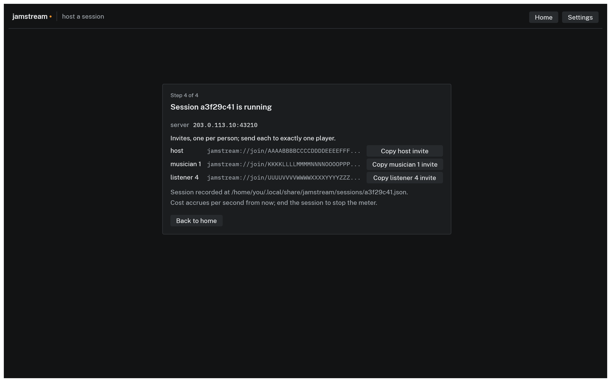

# Hosting a session

Hosting means launching one small virtual machine in your own cloud account, minting the invites, and ending the session when you are done. The CLI does all three; the desktop app's host wizard runs the same flow but currently launches only the built-in mock provider, so real sessions are hosted from the CLI.

## The region table

Before launching, JamStream measures the round trip from your machine to each of the provider's regions and prints a table:

```text
REGION              WORST RTT         HOURLY       EGRESS
nyc3                    14 ms    $0.02679/hr     $0.01/GB
tor1                    27 ms    $0.02679/hr     $0.01/GB
sfo3                    72 ms    $0.02679/hr     $0.01/GB
```

- **WORST RTT** is the slowest measured round trip, in milliseconds, among the people probing. At create time that is only you; your bandmates' distances are not known yet. The probes time a TCP handshake against each region's public endpoints, which tracks the UDP path closely enough to rank regions.
- **HOURLY** is the machine's current price per hour, fetched live where the provider offers it.
- **EGRESS** is what the provider charges per GB of outbound audio.

The pick weighs worst round trip and hourly price equally, and the table is printed in that order, best first. The top row launches unless you override it:

```console
$ jamstream host --provider digitalocean --region tor1 ...
```

A region under 30 ms from everyone keeps the network's share of latency in single digits each way, which is what makes the total playable. If the band spans a continent, pick the region that is mediocre for everyone over the one that is perfect for you; the person with the worst round trip sets the feel. See [Troubleshooting](troubleshooting.md) for what the numbers mean in the ear.


*The same table in the app's host wizard, step 2 of 4. Current build, mock provider, fabricated latencies.*

## Invites are minted at launch

`host` mints one invite per seat, up front, on your machine:

- `--musicians N` invites for players, default 4, not counting you. Cap 10.
- `--listeners N` invites for people who only listen, default 0. Cap 20.

Each invite is tied to one seat and signed; there is no way to add seats to a running session in the current build, so count heads before hosting. Unused invites cost nothing. See [Joining a session](joining.md) for how invites behave.


*Step 4 of 4 in the app's wizard: one copy button per invite. Current build.*

## The safety knobs

Every session carries two timers, both set at launch:

- `--idle-min`, default 10: with no musicians connected for this many minutes, the server shuts itself down and the machine is destroyed.
- `--max-hours`, default 12: the hard cap. The machine is destroyed at the cap no matter what, and invites expire with it.

There is no way to extend a running session; host a new one. The point of the caps is that a forgotten session costs a bounded, small amount, not a month of billing. [Understanding cost](cost.md) covers the other guardrails.

## While it runs

`jamstream status` lists your sessions with elapsed time, cost accrued so far, and a projection. In the app, the host's session screen shows the same cost figure live in the status bar, next to latency.

If you host from the app or another terminal later, the CLI also warns at host time when it finds JamStream-tagged machines already running in your account, so a stray session does not hide behind a new one.

## Ending

`jamstream end 3f2a9c01` (any unambiguous prefix of the session id works) or `jamstream end --last`. Ending destroys the machine, confirms with the provider that nothing tagged with the session is still listed, and marks the local record ended. The invites are dead from that moment.
