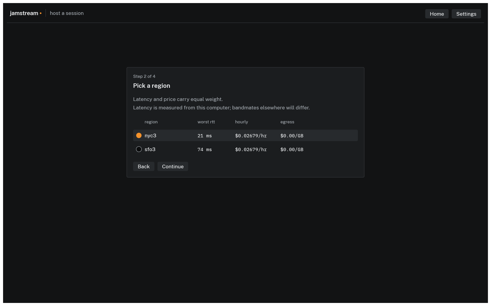
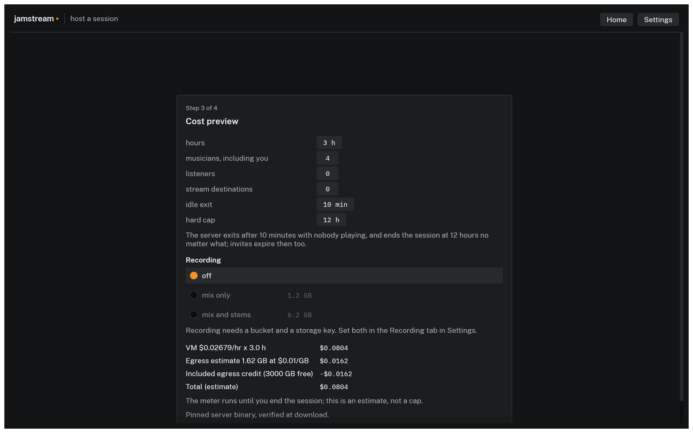
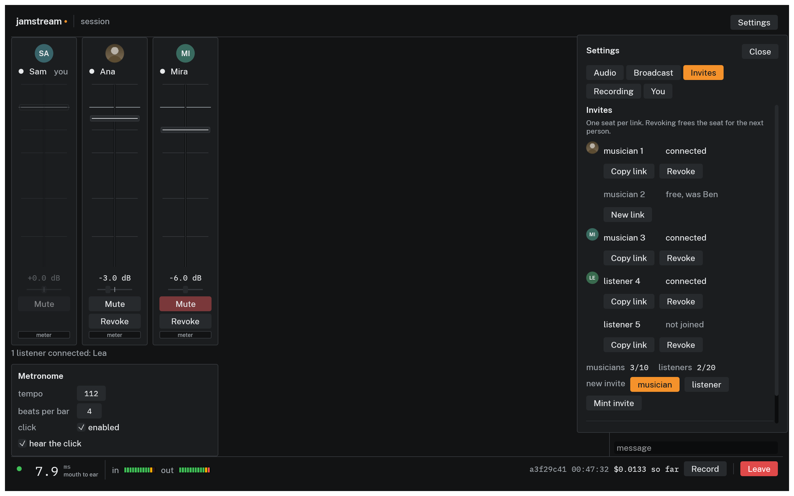

# Hosting a session

Hosting means launching one small server, minting the invites, and ending the session when you are done. In the app, **Host a session** on the home screen walks four steps: where the server runs, which region, a cost preview, and the launch itself. The wizard stores your provider credentials in the system keychain, joins you automatically once the server answers, and opens Settings on the Invites tab. The CLI does the same three jobs from the terminal, and both record the session in the same place, so a session hosted in the app shows up in `jamstream status` and can be ended from either side.

Hosting does not have to involve a cloud at all: picking **local** in the wizard's first step runs the server on your own computer, costs nothing, and is the right choice when everyone is on the same network. This page covers the cloud path; [Playing on the same network](local.md) covers local mode.

## The provider step

The first step lists where the server can run: local, then the three clouds, each with its status. A cloud with saved credentials reads `ready`; one without reads `setup needed`, and selecting it opens an inline pane that takes the credential, checks it with a real API call, and saves it to your keychain. [Provider setup](providers.md) walks each provider from zero.

## The region table

Before launching, JamStream measures the round trip from your machine to each of the provider's regions and shows a table:


*Step 2 of 4, with prices fetched live and latencies probed from the host's machine. The CLI prints the same table.*

- **worst rtt** is the slowest measured round trip, in milliseconds, among the people probing. At create time that is only you; your bandmates' distances are not known yet. The probes time a TCP handshake against each region's public endpoints, which tracks the UDP path closely enough to rank regions.
- **hourly** is the machine's current price per hour, fetched live where the provider offers it.
- **egress** is what the provider charges per GB of outbound audio.

Regions are sorted by worst round trip in 5 ms steps, with price breaking ties inside a step, best first. The top row is preselected; click another to override it (`--region` in the CLI).

A region under 30 ms from everyone keeps the network's share of latency in single digits each way, which is what makes the total playable. If the band spans a continent, pick the region that is mediocre for everyone over the one that is perfect for you; the person with the worst round trip sets the feel. See [Troubleshooting](troubleshooting.md) for what the numbers mean in the ear.

## The cost preview and the seats

Step 3 shows the expected hours, the seat counts, and the resulting estimate, all editable in place:


*Step 3 of 4. The same lines `jamstream host` prints, from the same live prices.*

- **hours** shapes the estimate only; the real bill is metered. Play longer and you pay for the time played.
- **musicians** is the number of playing seats, counting you: 4 means your own seat plus three invites to hand out. The cap is 10, which is also what the server admits. **listeners** are people who only hear the mix.
- **stream destinations** is how many platforms you expect to broadcast to, and it is the number here that moves the estimate most: about 1.2 GB per hour each, against roughly 0.4 GB for four musicians playing. It configures nothing; platforms are set up in the session itself, in [Streaming to Twitch and YouTube](streaming.md).

Under the numbers, release builds show one line naming the exact `jamstreamd` build the machine will download and verify at boot; there is nothing to configure. [Understanding cost](cost.md) explains every line of the estimate. Clicking **Launch** boots the machine, waits for its address, proves the server answers a real encrypted handshake, and joins you.

## Invites are minted at launch

One invite per seat is minted up front, on your machine, and the wizard opens Settings on the Invites tab the moment you are in:


*Each link admits one person. Copy, revoke, or mint more, and end the session for everyone from here.*

- Each row is one seat with a live status: `not joined`, `connected`, or `free`. Revoking a seat frees it: the row keeps the name it had, greyed, and **New link** mints a replacement into the same chair. **Copy link** puts that person's invite on the clipboard; send it to exactly one person over a channel you trust.
- **Revoke** ejects that member and kills their invite, with a confirmation step. The host also sees a Revoke button on each mixer strip.
- **Mint invite** adds a musician or listener seat mid-session, up to 10 musicians (you included) and 20 listeners. Unused invites cost nothing.

See [Joining a session](joining.md) for how invites behave on the other end. The CLI mints its seats with `--musicians` (default 4, counting you) and `--listeners` (default 0) and cannot add seats to a running session; the app's panel can, even for sessions the CLI hosted.

## The safety knobs

Every session carries two timers, both set at launch:

- the idle exit, 10 minutes by default: with no musicians connected for that long, the server shuts itself down. On DigitalOcean and AWS the machine is destroyed with it; on GCP it stops serving and is deleted when you end the session, on your next sweep, or at the hard cap.
- the hard cap, 12 hours by default: the machine is destroyed at the cap no matter what, and invites expire with it.

The app uses the defaults; the CLI can change both (`--idle-min` and `--max-hours` in the [host reference](../cli/host.md)). There is no way to extend a running session; host a new one. The point of the caps is that a forgotten session costs a bounded, small amount, not a month of billing. [Understanding cost](cost.md) covers the other guardrails.

## While it runs

The host's status bar shows cost so far next to the latency readout, with elapsed time beside it; nothing accrues silently. The **Broadcast** tab of Settings holds both halves of streaming: **Stream mix** sets what the platforms and the listeners hear, and **Destinations** puts the session on air to Twitch and YouTube Live. **Record** is the one action in the bar itself, and [Recording a session](recording.md) covers takes. Devices and buffer size can change mid-session from Settings in the top bar, and the change applies immediately; [Joining a session](joining.md#the-session-screen) walks the whole screen. `jamstream status` lists the same sessions from the terminal, with elapsed time, cost accrued so far, and a projection.

If tagged machines already exist in your account when you host again, the CLI warns at host time, so a stray session does not hide behind a new one.

## Ending

**End session for everyone** on the Invites tab destroys the machine, confirms with the provider that nothing tagged with the session is still listed, and marks the local record ended, with a progress sheet until the provider confirms. The invites are dead from that moment. Leaving is not ending: **Leave** disconnects you and the server keeps running until the host ends it or the idle exit fires.

## From the terminal

The CLI runs the same flow without a screen:

```console
$ jamstream host --provider digitalocean
$ jamstream status
$ jamstream end 3f2a9c01        # any unambiguous prefix, or --last
```

`host` prints the region table and cost preview, asks for confirmation, and prints one invite per seat; `end` confirms with the provider that nothing tagged with the session is still listed. Every flag is in the [CLI reference](../cli/index.md).
