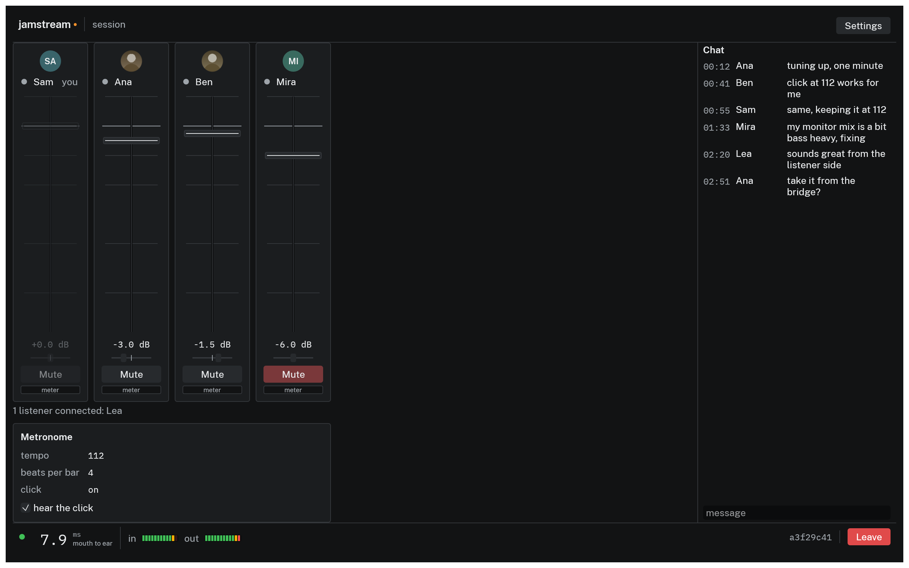
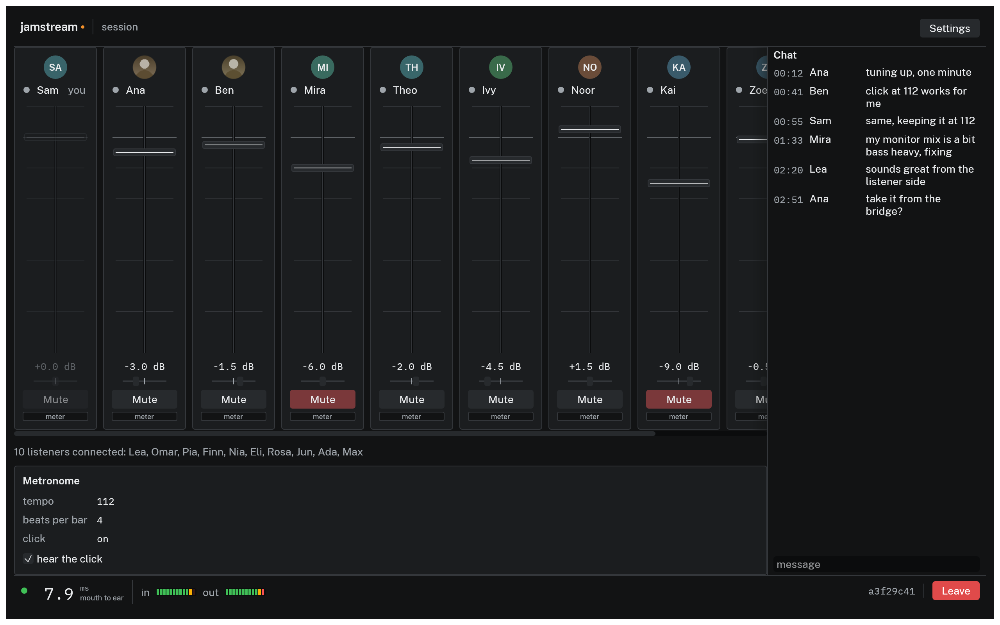
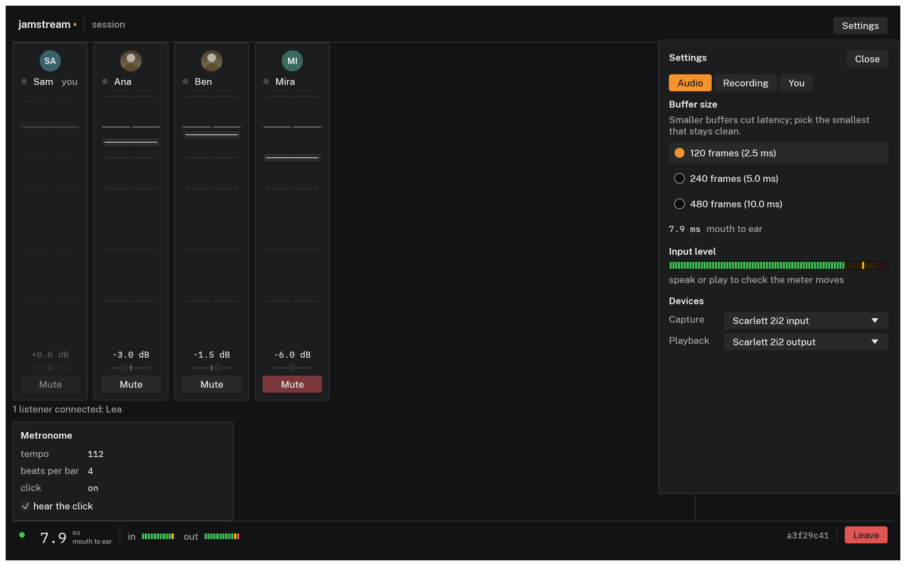

# Joining a session

You need exactly two things: the app, from the [Download](../download.md) page, and your invite, a string starting with `jamstream://join/`, sent to you by the host.

## What an invite is

Each invite admits one person to one seat in one session, signed by the host's key so it cannot be forged.

- Do not share your invite; two people cannot use the same one. If someone else needs in, the host mints another seat on the Invites tab.
- Losing your connection does not burn the invite. Close the app, move to another machine, rejoin with the same string; the seat is yours until the session ends or the host revokes it.
- Invites die with the session. There is nothing to clean up or keep secret afterward.
- Send invites over a channel you trust. Anyone holding your invite can join as you until it is revoked.

## Joining

Type your name into the **your name** field so the roster and any recorded stems say who you are instead of "musician 2"; it is remembered for next time, and it wins over whatever name the host put on your invite. Then paste the invite into the **Join a session** field (hint text: "paste an invite, jamstream://join/...") and click Join, or press Enter. A malformed or expired invite shows the reason under the field instead of joining. If every seat for your role is taken, the screen reads "the session is full; waiting for a seat to free" and the app keeps trying, so you are in as soon as somebody leaves.

## The session screen

Once connected you are in the session screen:


*A four piece session in the current build. One strip per musician; chat on the right; latency and meters on the left of the status bar.*

What you are looking at:

- One mixer strip per musician: an avatar disc, a presence dot, name, fader, pan, dB readout, and a Mute button. This is your personal monitor mix; moving Ana's fader changes what you hear, not what anyone else hears.
- The avatar disc shows a member's picture if they set one, and their initials on a color hashed from their name if they have not. The same disc and the same color appear on the card the broadcast renders, so a member looks the same in the app and on a stream.
- Your own strip is dimmed with a "you" tag. Self monitoring is local, on your interface, not through the server, so your own channel has no fader in the mix.
- The host additionally sees a Revoke button on every other strip. Revoking ejects that member and kills their invite, with a confirmation step.
- Chat, with timestamps. The metronome panel shows tempo, beats per bar, and click state; the host sets them, and "hear the click" is your own choice.
- The status bar, in the same place every session: mouth to ear latency in milliseconds and your meters on the left, ON AIR and REC in the middle, and the session id and Leave on the right. Hover the latency number for `rtt`, `buffer`, and `loss`, which [Troubleshooting](troubleshooting.md#latency-feels-high) turns into actions. Leave asks for a confirmation; leaving does not end the session, and your seat is kept.
- The **ON AIR** lamp, in the middle of the bar: absent until the host starts a broadcast, amber while one is running, and its hover says how many platforms are receiving it. Only the host can start or stop one, but everyone sees the lamp, because everyone is in it. See [Streaming to Twitch and YouTube](streaming.md).

A member who stops responding shows it in two stages. The dot beside their name turns amber after 2 seconds, which is 800 missed frames and far past anything a working client does. After 10 the server gives up on them: the strip grays out and reads disconnected. The dot stays nearly silent while somebody is playing, so the one to notice mid song is the one that changed. Their seat is held either way, and reconnecting with the same invite puts them back in it.

At ten musicians the strips extend past the window and scroll horizontally:


*A session at the 10 musician cap in the current build, with 10 listeners connected.*

## Devices and buffer size, mid-session

Settings in the top bar opens over the session without covering the strips or the status bar. It is in tabs, in this order: **Audio** for devices and buffer size, then **Broadcast** and **Invites** for a host whose own app launched the session, then **Recording** for where takes go, which is a setting of this computer and is there whatever the session is, and **You** for your avatar and the theme.


*Settings mid-session: device and buffer changes apply immediately; the stream reopens in place.*

- **Buffer size** offers 120, 240, or 480 frames (2.5, 5, or 10 ms). Pick the smallest that plays clean; crackles mean one step up. The mouth to ear figure under the choices moves with them, because the buffer is part of it. A choice outside what the selected device can deliver is annotated with the device's own minimum or maximum, because that is what you will really get.
- The **Input level** meter should move when you play. If it is still, the wrong capture device is selected or the operating system has not granted microphone access.
- **Capture** and **Playback** list a System default entry first, then your machine's real audio devices. Changing one mid-session reopens the audio stream on the new device without leaving the session, and Rescan picks up an interface plugged in after launch. Device and buffer choices are remembered across launches; a remembered device that is not connected at startup falls back to the system default until it returns.
- Any sample rate works. Sessions run at 48 kHz, and an interface at another rate (a 44.1 kHz deck, say) joins anyway: where the platform allows, JamStream sets the device to 48 kHz and says so in chat; otherwise it converts at the device edge, names both rates beside the latency number, and counts the added few milliseconds in it. Notes under the pickers name whatever is going on; [Troubleshooting](troubleshooting.md#device-problems) has the details and how to avoid the conversion cost.
- **Your avatar**, on the You tab, opens a file picker: pick a PNG or JPEG and everyone in the session gets the picture over the same encrypted link as the audio; a photo straight off a phone works as it is. The choice lasts for this run of the app; set it again after a restart. Remove drops it here and on your next join, though members already in the session keep the picture you sent them.

## From the terminal

For test rigs and machines without a display, the CLI joins headlessly with a WAV file as its instrument and writes what it heard:

```console
$ jamstream join 'jamstream://join/...' --headless \
    --input take.wav --output mix.wav --duration-secs 120 \
    --chat "bot checking in"
joined
roster: 3 members
chat from 1: heard you
left after 120 s; wrote mix.wav
```

Input must be a 48 kHz WAV, mono or stereo; after the file ends, the client sends silence. The received stereo mix lands in `--output`. Flags and details in the [CLI reference](../cli/join.md).
