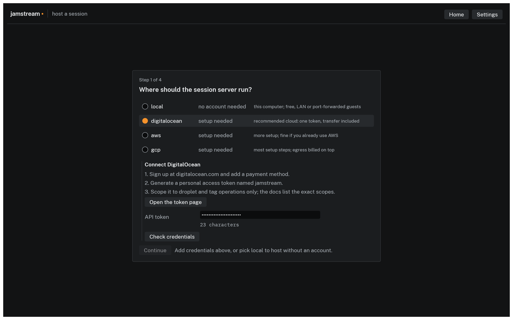

# DigitalOcean

The recommended provider: one token in one screen, and the droplet's included transfer covers a session's audio traffic. Total setup is about 10 minutes, most of it account signup.

JamStream launches an `s-2vcpu-2gb` Basic droplet: $0.02679 per hour as of July 2026, billed per second with a 60 second minimum, with 3,000 GB of transfer included ([pricing](https://www.digitalocean.com/pricing/droplets)). Powered-off droplets still bill on DigitalOcean, which is why JamStream only ever destroys them outright.

## 1. Create the account

1. Sign up at [digitalocean.com](https://www.digitalocean.com).
2. Add a payment method before creating anything; DigitalOcean requires one to verify the account. Cards, PayPal, Google Pay, and several others are accepted ([payment methods](https://docs.digitalocean.com/platform/billing/manage-payment-methods/)). Card signups may show a temporary preauthorization hold; PayPal makes a $5 authorization charge.
3. As of July 2026, new accounts get a $5 signup credit that expires 90 days after signup ([signup credit](https://docs.digitalocean.com/platform/billing/signup-credit/)). Promotions change; check the current terms. $5 covers roughly 60 session hours, so the credit alone funds a lot of rehearsal.

## 2. Create an API token

Follow [DigitalOcean's token guide](https://docs.digitalocean.com/reference/api/create-personal-access-token/); the short form:

1. Log in to the control panel at cloud.digitalocean.com. In the app's Connect DigitalOcean pane, **Open the token page** lands you in the right place.
2. In the main menu, open **Account**, then **API**. You land on the Applications & API page, Tokens tab.
3. Under Personal access tokens, click **Generate New Token**.
4. Name it something you will recognize later, like `jamstream`.
5. Pick an expiration. Shorter is safer; when it expires you generate a new one, which takes a minute.
6. For scopes, choose **Custom Scopes** and grant exactly these:

| Scope | Why JamStream needs it |
|---|---|
| `droplet:create` | launch the session server |
| `droplet:read` | find it and read its address |
| `droplet:delete` | destroy it when the session ends |
| `tag:create`, `tag:read`, `tag:delete` | every JamStream droplet is tagged, and the sweeper finds strays by tag |
| `firewall:create`, `firewall:read`, `firewall:delete` | each session gets its own firewall, created before the droplet so the server is never exposed unfiltered |
| `regions:read`, `sizes:read`, `actions:read`, `image:read`, `ssh_key:read` | required companions of `droplet:create` in DigitalOcean's scope system, and `sizes:read` is how live pricing is fetched |
| `snapshot:read`, `vpc:read` | further companions the droplet scopes pull in; JamStream never reads a snapshot or a VPC itself |

The scope names are from [DigitalOcean's scope reference](https://docs.digitalocean.com/reference/api/scopes/). The droplet scopes list the read scopes as requirements, so the token cannot be created without them. If the console offers to add a scope you did not pick, that is why: accept it. It shows the two in the last row as required once the others are selected, which brings the total to sixteen.

7. Click generate and copy the token immediately; it is shown once.

Scoped this way, the token can manage droplets, tags, and firewalls, and nothing else in your account: no storage, no DNS, no billing.

A token missing the firewall scopes fails at launch with `403 Forbidden: You are not authorized to perform this operation`, because creating the session firewall is the first thing a launch does. Add the three firewall scopes to the existing token; nothing needs to be recreated.

## 3. Connect the app

In the host wizard, select **digitalocean**; while no credential is saved the row reads `setup needed` and the Connect DigitalOcean pane opens:


*The credential pane in the current build.*

Paste the token into the API token field (Show reveals it if you need to compare) and click **Check credentials**. The app authenticates against the API with the pasted token, fetching a price and listing anything JamStream-tagged, and only a passing check saves it: the pane says "Works. Saved to your keychain." and the row flips to `ready`. A failure is shown verbatim, and nothing is stored.

The token lives in your system keychain from then on; the pane does not appear again. You are ready to host; continue with the [quickstart](../../quickstart.md#host-on-the-internet-with-digitalocean).

## 4. Optional: a Space and a Spaces key, for recording

[Recording a cloud session](../recording.md) writes takes to a Spaces bucket in your own account. **The Spaces key is not the API token from step 2.** That is the mistake everyone makes once: the `dop_v1_...` token cannot talk to Spaces at all, because Spaces is S3-compatible and signed with an access key pair rather than a bearer token.

1. In the control panel, open **Spaces Object Storage** and create a bucket in the region you host droplets in. Spaces is a flat $5 per month including 250 GB of storage and 1 TB of transfer, so a recording adds nothing if you already have one. Give recordings a bucket that holds nothing else.
2. Still under **Spaces Object Storage**, open the **Access Keys** tab and click **Create Access Key**. Name it `jamstream-recording`. Arming a session sets the bucket's expiry rule as well as writing to it, so the key needs full access to that bucket: a read-only or write-only key fails the check while you are configuring.
3. Copy the secret immediately; it is shown once.

Keep it to the recording bucket. Launching a recorded session writes this key into the droplet's user data, so its worst case should be junk in a folder the retention rule empties anyway.

Paste both values into **Settings**, then **Recording**, in the app, and click Check. From the terminal the pair goes in `JAMSTREAM_RECORDING_ACCESS_KEY_ID` and `JAMSTREAM_RECORDING_SECRET_ACCESS_KEY`, or in `SPACES_ACCESS_KEY_ID` and `SPACES_SECRET_ACCESS_KEY`; [`jamstream recordings`](../../cli/recordings.md#the-storage-key) covers every provider.

Spaces is not offered in every droplet region. If the check says so, it names the regions that have it.

## For the CLI and automation

The CLI reads the token from the environment instead:

```console
$ export DIGITALOCEAN_TOKEN=dop_v1_your_token_here
$ jamstream sweep --dry-run --provider digitalocean
No jamstream-tagged instances found.
```

That output means the token authenticates and can list droplets. Add the export to your shell profile if you host from the terminal regularly, or keep the token in a password manager and export it per session. The app reads `DIGITALOCEAN_TOKEN` as a silent fallback too, so a machine set up this way is `ready` in the wizard with nothing pasted.
