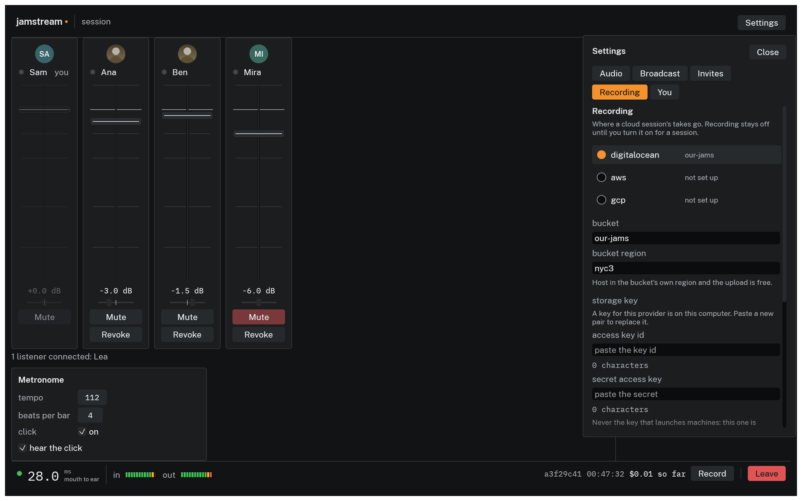
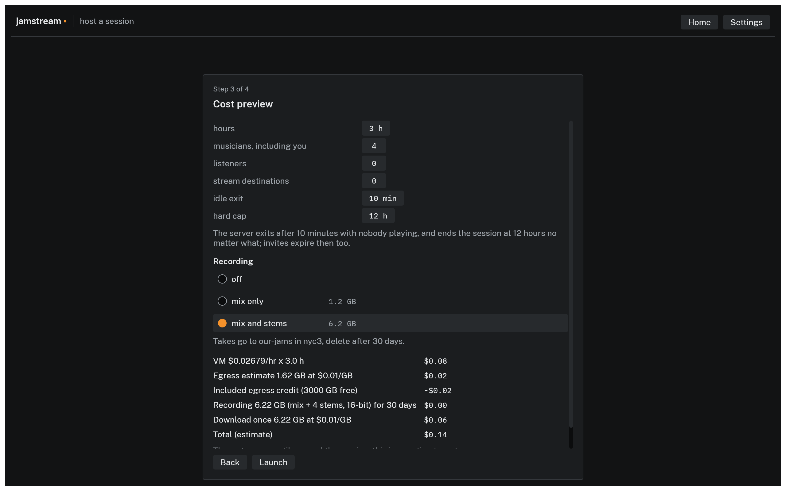
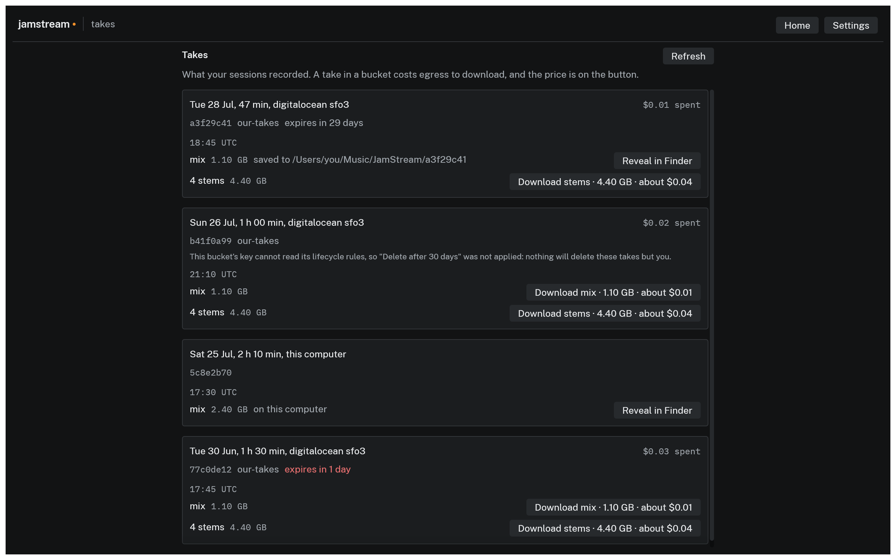
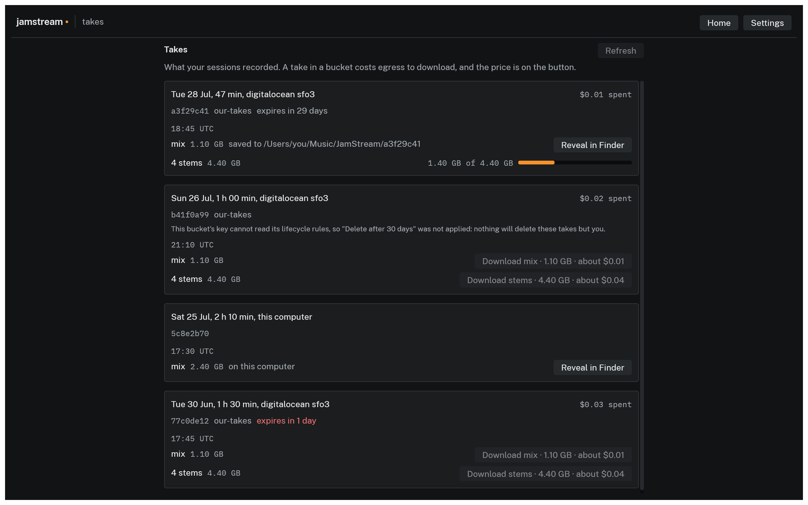

# Recording a session

A take is the mix your listeners heard, written as 16 bit 48 kHz FLAC.

Nothing is captured by surprise. Recording is armed at launch, and a take runs only while the host holds it open: each Record to Stop is one take.

## Set up a bucket once

A cloud session records to a bucket in your own account, because the machine deletes itself when the session ends and a take on its disk goes with it. Open **Settings**, then **Recording**:


*Set up once per computer. The key is masked and never shown again.*

1. Pick the provider holding the bucket, and name the bucket and the region it is in. Host in that region and the upload costs nothing.
2. Paste the storage key pair. **This is not the credential that launches machines.** Launching a recorded session writes this key into the session machine, so scope it to writing the recordings prefix of one bucket. The last section of your [provider's page](providers.md) makes exactly that key.
3. Click **Check**. It writes one small object to the bucket and deletes it. A pass saves the key in this computer's keychain; a failure says what to change and saves nothing, so a wrong key fails while you are pasting rather than mid-song.
4. **keep takes for** sets the default retention for new sessions: 7, 30 or 90 days, or forever. It saves as you pick it, unlike the bucket and the key, which save on a passing Check. The default is 30 days, and it is a rule on the bucket itself, so it keeps being enforced long after the machine is gone.

A session on your own computer records to your own disk and needs none of this.

## Arm it at launch

Whether a session can record, and whether stems are captured alongside the mix, are fixed before anyone plays and cannot change once the session is running. Both choices sit on the host wizard's cost preview:


*Off, the mix, or the mix and stems, with what each costs before you launch.*

| Choice | Captures | Size, three hours, four piece |
|---|---|---|
| off | nothing; every launch starts here | none |
| mix only | the stereo mix listeners hear | about 1.2 GB |
| mix and stems | the mix, plus one stereo file per musician | about 6.2 GB |

The size sits beside each row in the wizard, and the estimate below moves as you pick, because that is the moment the difference matters.

With no bucket set up, the two recording rows are disabled and say so, pointing at the Recording tab. A local session has no such requirement: the rows are live and the takes land on this computer.

Launching proves the key can write this session's own prefix, and sets the retention rule before the machine is paid for.

> Setting retention needs a key that can also **read** the bucket's existing rules, not just write to it.
>
> Without that permission the session still records, but retention can't be set: takes are kept indefinitely and go on costing storage until you delete them yourself. `jamstream host` says so in the line it prints after the bucket check.
>
> The fix is the read permission in the recording step of your [provider's page](providers.md).

## From the terminal

`--record` records a local session; `--bucket` names a bucket and implies it.

```console
$ jamstream host --provider local --record --yes
$ jamstream host --provider aws --region eu-west-1 --bucket my-jams --yes
```

The CLI reads the storage key from `JAMSTREAM_RECORDING_ACCESS_KEY_ID` and `JAMSTREAM_RECORDING_SECRET_ACCESS_KEY` rather than from the keychain; [`jamstream recordings`](../cli/recordings.md#the-storage-key) says why it is those and not a provider's launch pair.

`--record-stems` captures stems and implies `--record`; `--retention` takes 7d, 30d, 90d or forever. Every flag is in the [host reference](../cli/host.md).

A session launched without recording cannot be talked into it later. Press Record on one and it answers `recording is not configured for this session` straight away, so you find out before the song rather than after it.

## Starting a take

**Record** in the session's status bar opens the Record sheet. Only the host has either.

The sheet shows the take's state, a line saying whether stems are being captured, **Record** to start a take, **Stop** to end it, and **Close**. Closing the sheet does not stop a take, and neither does leaving the session; a take stops when the host presses Stop or when the session ends.

While a take runs, **REC** lights in the middle of the bar for everyone in the session. Hover it and it reads "this session is being recorded". Nothing lights while the recorder is idle.

## Where takes land

Files carry the take's date and time in UTC, and stems carry the player's name:

```text
jamstream-2026-07-28-1930-mix.flac
jamstream-2026-07-28-1930-Ana.flac
```

| Where | Location | Expires |
|---|---|---|
| This computer | `recordings` folder under your platform's data directory | never; only you delete a take |
| Bucket | `jamstream/recordings/` plus the session id, in the bucket you named | the retention choice: 7, 30 or 90 days, or forever (default 30) |

### On this computer

Named in the wizard when you arm a local take, and printed at launch by the CLI:

```console
$ jamstream host --provider local --record --yes

Session 3f2a9c01 is running.
server       192.168.1.12:43210
record dir   /Users/you/Library/Application Support/jamstream/recordings
host         jamstream://join/r6edH1LCtlT3vPPiILRRVAEACgAAAcrRAjiV...
```

| Platform | Folder |
|---|---|
| macOS | `~/Library/Application Support/jamstream/recordings` |
| Linux | `~/.local/share/jamstream/recordings`, or under `$XDG_DATA_HOME` |
| Windows | `%LOCALAPPDATA%\jamstream\recordings` |

`jamstream end` never removes a recording. Nothing but you deletes a take.

A take still being written ends in `.part` and is renamed when it finishes, so a laptop that dies mid-song leaves a file that does not look like a finished recording.

### In a bucket

The take uploads while you play, so ending the session waits only for the last of it.

> Let the `UPLOADING` lamp clear before you end the session. The machine holds on for ten minutes to finish an upload and then shuts down regardless, and a take still in flight at that point is lost.

Downloading is where recording costs money, because your cloud account bills egress on the way out and nothing on the way in.

## Getting your takes

**Takes**, on the Recent sessions card on Home once a session is listed there, is every take this computer knows about, newest first.


*A row is one take. The mix is already on this computer here, so it offers Reveal; the stems are still in the bucket and carry their price.*

One row is one take, meaning one Record to Stop, so two takes of the same song are told apart by when they started and how big they are. The mix and the stems of a take are separate rows, because the stems are several times the bytes and pulling them is where the money is:

- A take on this computer offers **Reveal in Finder** (Windows: **Show in File Explorer**, Linux: **Show in Files**), opening its folder with the file selected. A local session's takes are here from the moment you press Stop.
- A take in a bucket has a button reading **Download mix · 1.10 GB · about $0.01**: the half, its size, and what your own account will bill for the egress. Clicking it starts the transfer; there is nothing further to confirm.
- Downloaded takes land in a `JamStream` folder in your music folder, one folder per session. The row then offers Reveal instead.

A take can be gigabytes, so a download takes a while. The row shows how much of it has arrived, and the other takes wait until it finishes:


*One download at a time.*

Takes outlive the session that made them: one from a session that ended weeks ago is still here.

- Where the bucket is really deleting them on a schedule, the session's card counts down to that, in red for the last three days.
- Where the retention choice could not be applied, the card says so rather than counting down to nothing.
- A take that is still uploading is not in the bucket yet, so it appears here when it finishes and not before.
- An expired take with no copy on this computer drops off the list once the window is full, and a line says how many.
- Once the bucket has deleted a take you had already downloaded, the card says it is kept on this computer and the row still reveals the file in your music folder.

### From the terminal

[`jamstream recordings`](../cli/recordings.md) lists and fetches the same takes, for scripts and machines with no screen. It reads the storage key from the environment and not from your keychain, so export the pair before you use it even if the app already has the key saved.

## The mix, and stems

Without stems, a take is one stereo file. With stems it is one stereo file per musician as well, each carrying that player's own signal. The sheet reads back which of the two you launched with.

Stems are stereo rather than mono, so a stem is the same size as the mix, which is why mix-and-stems costs about five times mix-only for a four piece. Every file in a take starts at the same zero, so they line up when you import them.

## What the room sees

| The sheet reads | The bar shows | What it means |
|---|---|---|
| `idle` | nothing | armed, with no take running |
| `recording` | `REC`, a filled lamp | a take is running |
| `uploading` | `UPLOADING`, a hollow lamp | the take ended and the last of it is still going to the bucket. Record is disabled until it clears |
| `failed` | `REC FAILED`, a hollow lamp | the take stopped, with the reason |

A take on your own disk is finished the moment you press Stop, so it never reads `uploading`.

## When it fails

The reason is in the sheet and on the lamp's hover, verbatim, for everyone in the room. A failure ends the take, not the session: press Record again for the next one.

| Reason begins | What to do |
|---|---|
| `recording is not configured for this session` | the session was launched with recording off; host a new one with it on |
| `cannot start the recorder`, `cannot open the mix file` | the folder, or the first object in the bucket, could not be created. For a local session, check that the printed path exists and is writable |
| `recording failed` | a write failed mid-take: a full disk, or a bucket that stopped accepting the upload. The take is abandoned rather than left half written |
| `recording could not be finished` | the end of the take could not be written. Earlier takes in the session are unaffected |

## What it costs

A local take costs disk and nothing else. A take in a bucket costs a few cents of storage while it sits there, and egress when somebody downloads it. [Understanding cost](cost.md#recording) has the numbers.
