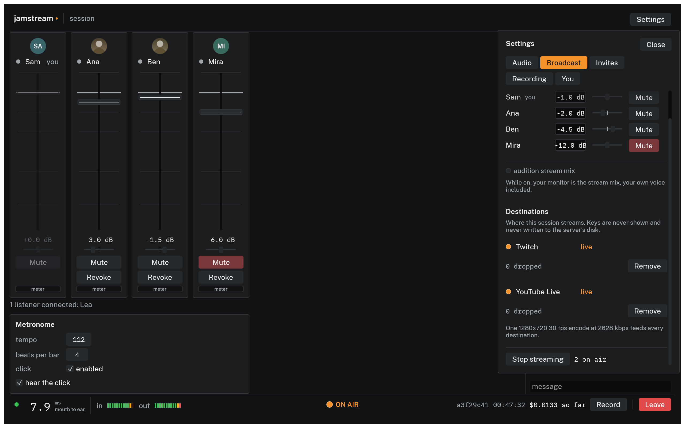
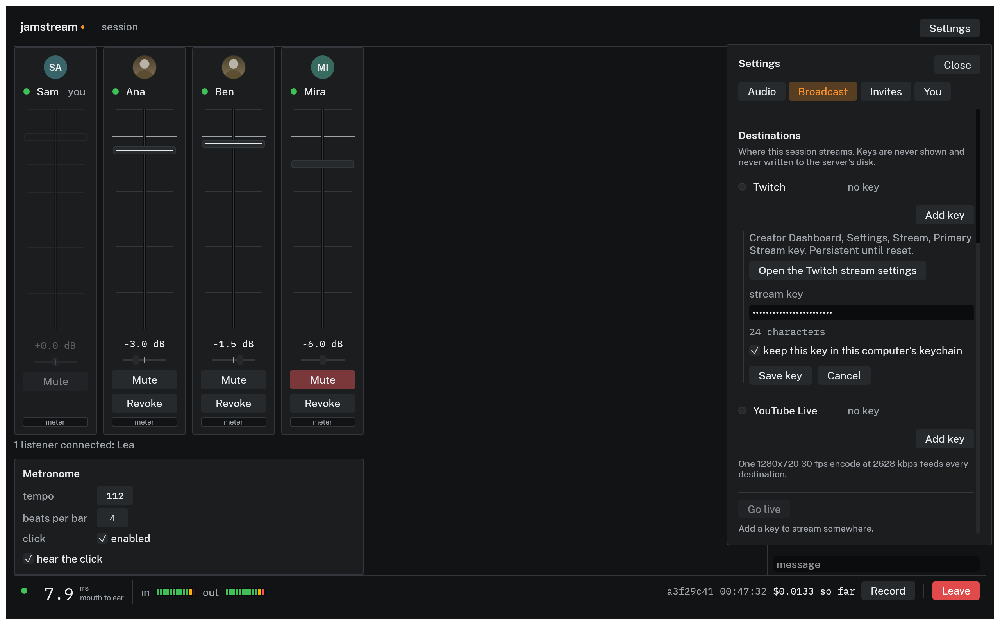
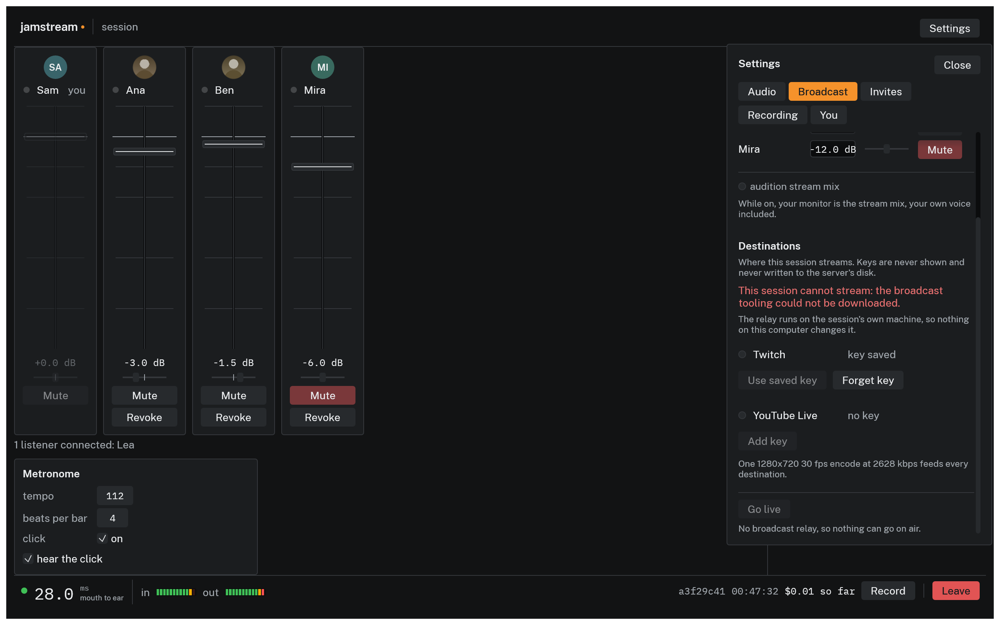
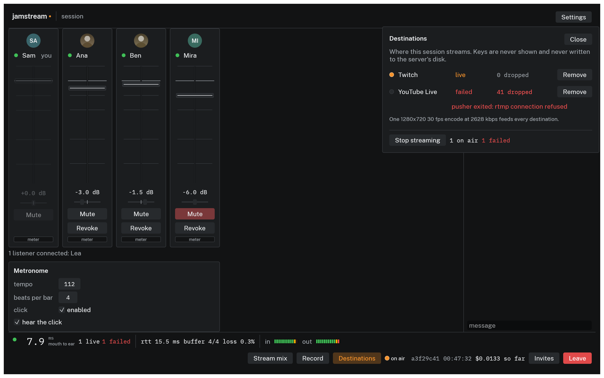

# Streaming to Twitch and YouTube

The host can put a session on air to Twitch and YouTube Live, either one alone or both at once. A platform that refuses its key or drops its connection does not take the other one with it; one encode feeds both, so a failure in that encode stops both.

Only the host can start or stop a broadcast. Everyone in the session sees the ON AIR lamp in the middle of the status bar, because everyone in the session is in the broadcast.

*On air to both platforms.*

## What goes out

The broadcast mix, over a card of the musicians: an avatar or their initials, their name, and a level meter each, with the listeners as a count in the footer. The host shapes that mix at the top of the **Broadcast** tab in Settings, and it is not the same as anyone's monitor mix.

To hear exactly what the stream carries, switch on **audition stream mix** there. It replaces the host's monitor mix with the stream's, own voice included, and lights an AUDITION lamp for as long as it is on.

## Getting a stream key

Both platforms give you a key that keeps working session after session.

| Platform | Where to find it |
|---|---|
| Twitch | Creator Dashboard, Settings, Stream, Primary Stream key |
| YouTube Live | YouTube Studio, Go Live, Stream, Stream key |

A YouTube channel needs live streaming enabled once before that key appears, which can take 24 hours on a new account. Do it before the band is waiting.

**Add key** under Destinations shows these same steps, with a button that opens the platform's page.

## Going live

**Settings**, then the **Broadcast** tab: the stream mix is at the top and Destinations under it.

1. **Add key**, paste the key, **Save key**. The row reads `asking`, then `ready` once the server has it.
2. Repeat for the second platform if you want both.
3. **Go live**.

*Adding a Twitch key. The field never shows the key back, so a paste is checked by the character count.*

ON AIR lights for everyone in the session once a platform is actually taking the broadcast, which is a few seconds after the press. You can add or drop a platform while you are on air; **Remove** stops that one and leaves the others streaming.

Your key is treated as a credential. Leave **keep this key in this computer's keychain** on and the next session starts with **Use saved key** instead of a paste; **Forget key** deletes it again.

## When a session cannot stream

A broadcast goes out through a relay that runs on the session machine, alongside the server. It is downloaded when the session boots, and a session runs perfectly well without it: the band plays, listeners listen, takes record. Only the broadcast needs it.

The **Broadcast** tab says so when it is missing, with the reason, and every control that would send a key somewhere is off, because it would have nowhere to go.

*Nothing on this computer can fix this one: the relay is on the session machine.*

The session server checks the relay every five seconds for as long as the session lasts. This appears if the relay dies mid-session too, and clears if it comes back; nothing on your computer affects it, so to broadcast, start another session.

A relay that never answered at all is given three minutes before it is reported, so a fresh session says nothing about it either way for that long.

A session hosted on your own machine is the other way round, because the session machine is yours.

> It broadcasts through `ffmpeg` and `mediamtx` on your own `PATH`, and the app installs neither: `brew install ffmpeg mediamtx` on macOS, `apt install ffmpeg` plus a [mediamtx release](https://github.com/bluenviron/mediamtx/releases) on Linux.
>
> Without them the reason says which one is missing. Broadcasting from a local session does not work on Windows at all yet; host in the cloud for that.

## While you are on air

Each row says what that platform is actually doing:

| Row reads | What it means |
|---|---|
| `no key` | nothing configured for this platform |
| `key saved` | a key is on this computer, one click from being used |
| `asking` | the server has not answered yet |
| `ready` | configured, and goes live when you press Go live |
| `connecting` | starting up; nothing is reaching the platform yet |
| `live` | the platform is receiving the broadcast |
| `failed` | it stopped, with the reason on the next line |

Under the rows, one line names the encode every destination shares: 1280x720 at 30 fps, 2628 kbps. Under that are two frame counts, also one pair for the whole broadcast, so every row shows the same two, and each changes color as it rises:

| Term | What it counts | What it means |
|---|---|---|
| repeated | frames the machine had no time to draw; sent again as the last picture | sound stays in step but the video stutters; a climbing count means the machine is at its limit |
| dropped | frames the encoder would not take; gone for good | the video falls that many pictures short of the sound |

Repeats come first, and losses only once the machine is well past keeping up, so any dropped frame is worth acting on. Removing a destination brings neither count down, because one encode feeds every platform. What helps is a shorter session, a smaller machine load, or one platform instead of two.

## When a platform fails

*One platform's connection failed; the other kept streaming.*

A stream that dies quietly is worse than one that never started, so a failure shows in three places: the row goes red with the reason under it, the tab counts the failures, and the status bar lights STREAM FAILED even with Settings closed.

A destination that stops is retried on its own, on a backoff that starts at 500 ms and doubles to 16 seconds: the row goes back to `connecting`, and to `live` once the platform is taking the broadcast again.

A key the platform rejects fails every time, and the reason says so. **Remove** that destination, then **Forget key** before **Add key**: while the key is still saved the row offers **Use saved key**, which sends the rejected one again.

The reason is what the encoder or the pusher printed, quoted, up to two lines of it. Read the front of it first.

| Reason starts with | Where it broke |
|---|---|
| `push failed:` | sending the encode to the platform |
| `encoder down:` | making the encode in the first place, before any platform is involved |

Then read what follows. `Failed to connect to rtmps://<redacted>` with `Connection refused` is the platform saying no, so the key is wrong, was reset, or belongs to another channel. Everything after the `://` is stripped, host included, because the key is in there.

`Failed to connect to <local relay>` is the session machine failing to talk to itself, which no key change will fix; restart the session.

**Stop streaming** takes everything off air at once, with no confirmation step, because a host who needs the stream to stop needs it to stop now. Ending the session stops it too.

## What it costs

Broadcasting is the one part of a session that moves real traffic. Set **stream destinations** on the wizard's cost preview and the estimate counts it; [what egress is](cost.md#what-egress-is) has the numbers.

Twitch and YouTube Live are the two platforms this build supports, because they are the two tested end to end. Both hand out a key that keeps working, which is what lets a session be set up before the band arrives.
