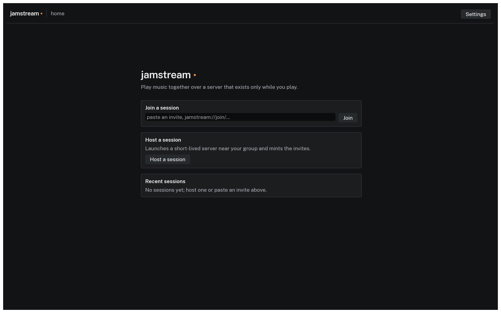

# Introduction

JamStream is a desktop app that lets a band play together over the internet with latency low enough to actually play. One of you hosts: the app starts a small server on your own computer or in your own cloud account, close to your group, and it exists only for the length of the session. Everyone else pastes a personal invite link into their app; there are no accounts and no JamStream servers in the middle. Every packet is encrypted, and the server shuts itself down when the music stops. When the session ends, you have paid your cloud provider a few cents and nobody else anything.

*The home screen in the current build: paste an invite or host a session.*

## What it costs

Sessions hosted on your own computer cost nothing. For cloud sessions you pay your cloud provider directly, by the second, for one small virtual machine. For a three hour session with four musicians on the cheapest suitable machines:

| Provider | Machine | Machine cost | Audio traffic (about 1.6 GB) | Total |
|---|---|---|---|---|
| DigitalOcean | s-2vcpu-2gb, $0.02679/hr | $0.080 | inside the included transfer | about $0.08 |
| AWS | t4g.medium, about $0.034/hr | $0.101 | inside the free 100 GB/month | about $0.10 |
| GCP | e2-medium, about $0.034/hr | $0.101 | about $0.19 at $0.12/GiB | about $0.30 |

These are public on-demand prices as of July 2026 and they drift. The cost preview shown before every launch pulls current pricing and is the number to trust; see [Understanding cost](guides/cost.md).

## Streaming

The host can put a session on air to Twitch and YouTube Live, either one or both at once, and one platform dropping out never interrupts the other. Stream keys are masked, never shown back, and kept in your system keychain. See [Streaming to Twitch and YouTube](guides/streaming.md).

## Project status

JamStream is in beta; the current release is v0.1.1-beta, downloadable for macOS, Windows, and Linux from the [Download](download.md) page.

- The desktop app is the product: its wizard hosts real sessions on your own computer or in your cloud account, joins you automatically, and manages the invites while the session runs. Every app build bundles its own `jamstreamd` session server, so hosting locally needs nothing else installed. Screenshots on this site are from the current build and will change.
- The `jamstream` command line tool hosts, monitors, and ends the same sessions for automation, scripting, and headless use; see the [CLI reference](cli/index.md).
- Release builds carry their own `jamstreamd` server build pinned in: hosting on a cloud provider downloads and verifies that exact build with no configuration. Only source builds still point at a server build hosted elsewhere; the [host reference](cli/host.md) shows where those flags go.

If something here does not match what the software does, that is a bug in one of them. [Report it.](about.md)
