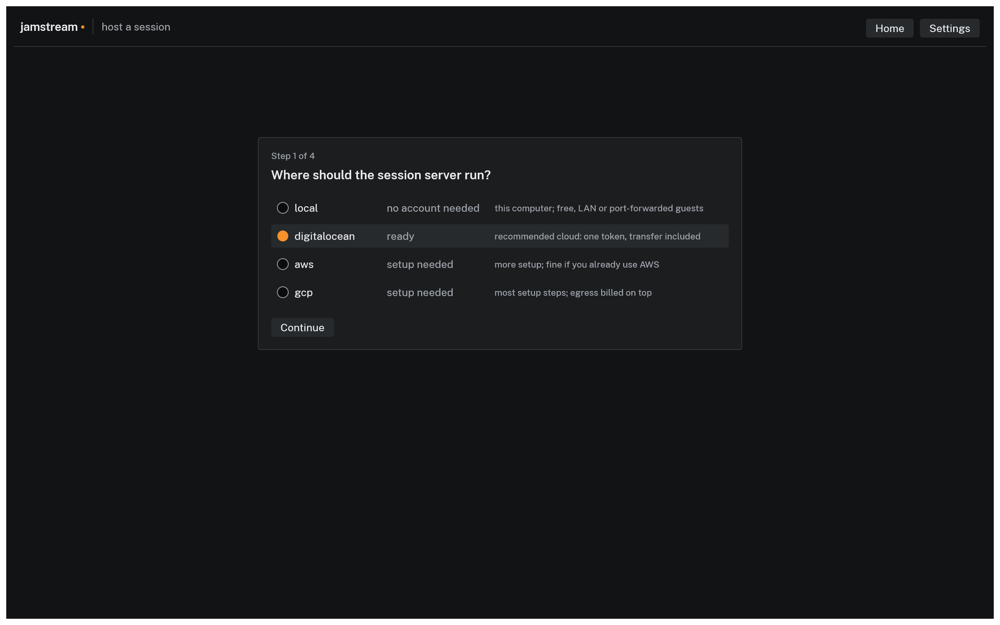

# Quickstart: host your first session

Two paths from nothing to a running session, both in the desktop app. The local path takes about five minutes, needs no cloud account, and works for musicians in the same room or on the same network. The internet path launches the server in your own DigitalOcean account so bandmates anywhere can join; expect 20 minutes the first time, most of it on the DigitalOcean account.

## 1. Get the app

Download the desktop app for your platform from the [Download](download.md) page and open it. The app carries its own `jamstreamd` session server, so there is nothing else to install.


*The home screen: paste an invite to join, or host a session.*

## 2. Host on this computer

Click **Host a session**. The wizard's first step asks where the session server should run:


*Step 1 of 4. Local needs no account; a cloud shows ready once credentials are saved.*

Pick **local** and click Continue. Local has no region to pick, so the wizard jumps to a "Before you start" step where you set the number of musician and listener seats and it confirms the session costs nothing. Click **Start the session**.

The app starts a real `jamstreamd` process on your machine, completes a full encrypted handshake with it before showing you anything, joins you automatically, and opens Settings on the Invites tab. On Windows, the first local host raises a Defender Firewall prompt for `jamstreamd.exe`: allow it on both Private and Public networks, or bandmates on your network time out after 10 seconds when they join.

## 3. Share the invites


*The Invites tab, open the moment you are hosting. Each link admits one person.*

Each row is one seat. Click **Copy link** on a row and send that link to exactly one person, over any channel you trust. Rows read `not joined`, `connected`, or `revoked` as people come and go, and **Mint invite** adds seats mid-session. Details in [Hosting a session](guides/hosting.md).

## 4. Bandmates join

Everyone else opens the app on their own machine, pastes their invite into the **Join a session** field on the home screen, and clicks Join or presses Enter. A malformed or expired invite shows the reason under the field instead of joining.

Local invites carry your machine's network address (192.168.1.12 style), so they work from any machine on the same network. They do not work across the internet; bandmates elsewhere need the DigitalOcean path below, or router port forwarding, which [Playing on the same network](guides/local.md) explains honestly.

## 5. End it

On the Invites tab, click **End session for everyone**. The server process is killed and every invite is dead from that moment. A forgotten local session costs nothing, and the server also exits on its own after 10 minutes with no musicians connected.

That is the whole local loop. The rest of this page is the internet path.

## Put it on air

Any session, local or cloud, can stream live to Twitch, YouTube Live, or both at once while you play. The **Broadcast** tab of Settings takes a stream key per platform, and ON AIR lights in the status bar for everyone in the session. Dropping one platform leaves the other streaming. See [Streaming to Twitch and YouTube](guides/streaming.md).

## Host on the internet with DigitalOcean

The flow is the same wizard; the server runs on a small droplet in your own DigitalOcean account instead of on your machine, and the invites work from anywhere.

### Connect your account

In the wizard's first step, pick **digitalocean**. With no saved credentials the row reads `setup needed` and the Connect DigitalOcean pane opens under it:


*The in-app credential pane. The token is checked with a real API call before it is saved.*

1. Sign up at digitalocean.com and add a payment method. The [DigitalOcean setup page](guides/providers/digitalocean.md) has every step from zero, including the exact token scopes.
2. Click **Open the token page** and generate a token scoped to droplet and tag operations only; copy it, it is shown once.
3. Paste it into the API token field and click **Check credentials**. On success the pane says "Works. Saved to your keychain." and the row flips to `ready`.

The token lands in your system keychain, so this is a one-time step; next session the row is `ready` from the start.

### Pick a region and launch

Click Continue. The app fetches live prices and times the network from your computer to each of the provider's regions, then sorts them by worst round trip in 5 ms steps, with price breaking ties inside a step. Take the top row unless you know your bandmates sit far from you; [Hosting a session](guides/hosting.md#the-region-table) explains how to pick fairly.

The next step is the cost preview: set the expected hours and seats, read the estimate (a three hour four musician session on DigitalOcean is about $0.08), and click **Launch**. The wizard boots the machine, waits for its address, proves the server answers a real encrypted handshake, joins you, and opens Settings on the Invites tab. There is no server to find or upload: release builds carry their release's own `jamstreamd` build pinned in, and the machine verifies the download at boot.

The meter is now running. The droplet bills by the second until you end the session, and it shuts itself down after 10 minutes with no musicians connected, or at the 12 hour hard cap, whichever comes first.

### Share, check, end

The Invites tab works exactly as in the local path; the links now work from anywhere. While the session runs, cost so far sits in the status bar next to latency. **End session for everyone** destroys the droplet and confirms with DigitalOcean that nothing tagged with the session is still listed. If you ever doubt that everything is gone, [Understanding cost](guides/cost.md#the-guardrails) covers the sweeper.

## From the terminal

The `jamstream` CLI hosts, monitors, and ends the same sessions, for scripts, automation, and machines without a display. One line installs it on macOS and Linux (the [Download](download.md) page has the Windows line and every artifact):

```console
$ curl -fsSL https://sean-reid.github.io/jamstream/install.sh | sh
```

Cloud credentials come from the environment (for example `DIGITALOCEAN_TOKEN`); local hosting with the CLI alone also needs a `jamstreamd` on this computer, which the install script's `--with-server` flag provides on Linux. `host` shows the region table and the cost preview, asks for confirmation, and prints one invite per seat once the server answers a real handshake:

```console
$ jamstream host --provider digitalocean
...
Launch this session? [y/N] y

Session 3f2a9c01 is running.
server       203.0.113.10:43210
host         jamstream://join/r6edH1LCtlT3vPPiILRRVAEACgAAAcrRAjiV...
musician 1   jamstream://join/r6edH1LCtlT3vPPiILRRVAEACgAAAcrRAjiW...
...
End the session with: jamstream end 3f2a9c01

$ jamstream status
SESSION    PROVIDER/REGION      STATUS      ELAPSED      ACCRUED      PROJECTED
3f2a9c01   digitalocean/nyc3    running    1 h 04 min    $0.028576 $0.08037 at 3.0 h

$ jamstream end 3f2a9c01
Session 3f2a9c01 ended. Instance 512190713 is destroyed.

$ jamstream sweep --dry-run
No jamstream-tagged instances found.
```

The invite strings are shortened here; real ones are about 220 characters. A headless client can even join with a WAV file as its instrument; see [jamstream join](cli/join.md). Sessions live in shared state files, so the CLI sees sessions the app hosted and can end them, and the app can end sessions the CLI hosted. Every command and flag is in the [CLI reference](cli/index.md).
